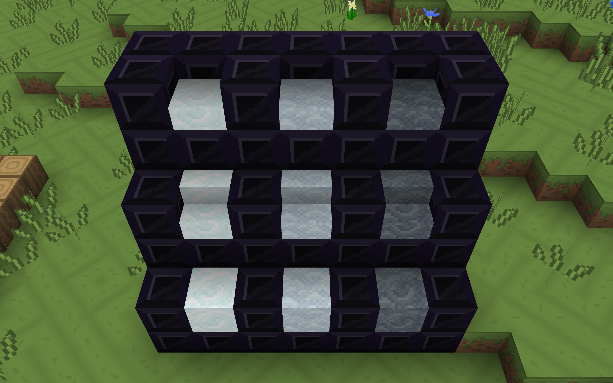
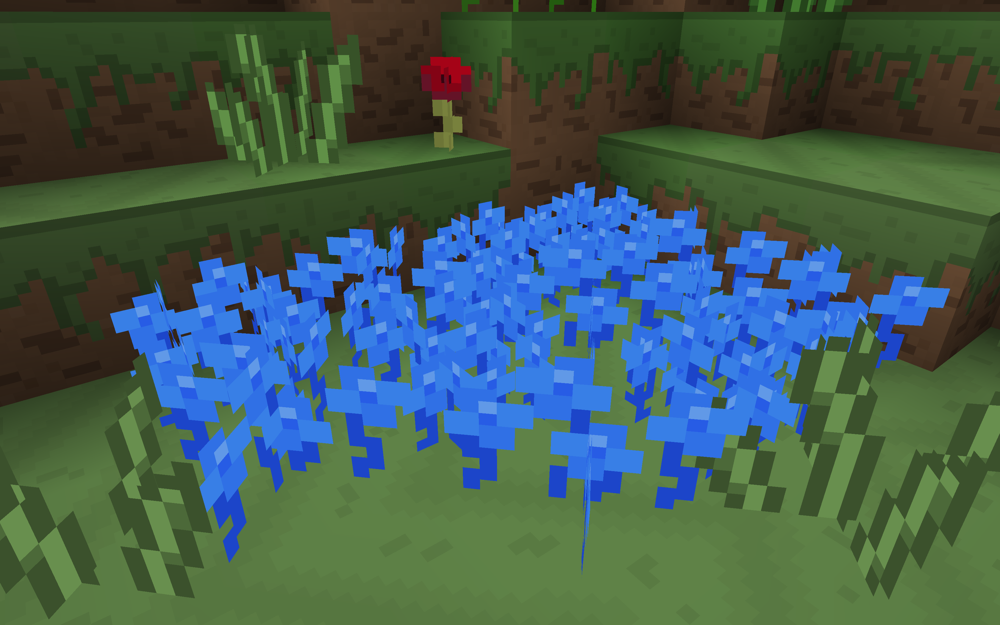
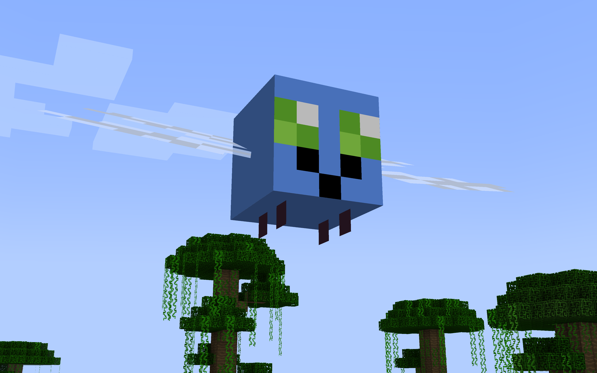

# HarmonyCraft

A Fabric mod that adds features to Minecraft inspired by the world of MLP FiM.

This mod is designed to work with the [Love & Tolerance](https://love-tolerance.com/) resource pack, which in turn aims to mimic the show's style in pixel art form

[Discord](https://discord.gg/U8xEVMKkeF)

### Screenshots

### Credits

[me - programming](https://github.com/stickacupcakeinmyeye) \
[Skelegant - textures (thank you!!)](https://github.com/Skelegant) \
Everypony behind making MLP!

### License

[zlib](LICENSE)